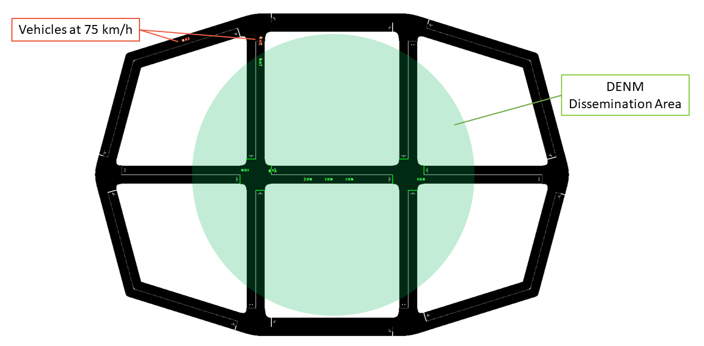
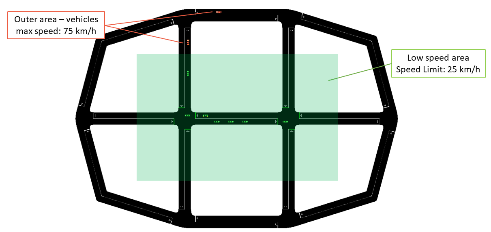
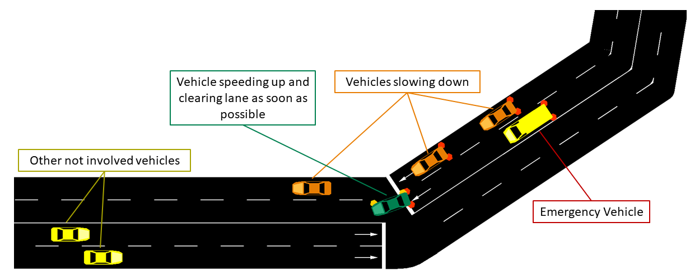

============================================
Sample V2I example and V2I/V2N applications
============================================

*ms-van3t* supports two stacks/communication technologies for V2I/V2N:

- 802.11p, which communicates, for instance, with a Road Side Unit 
  (sample program name: ``v2i-areaSpeedAdvisor-80211p``)
- LTE, for V2N communications (sample program name: ``v2i-areaSpeedAdvisor-lte``)

To run the sample V2I program, you can use the following commands:

.. code-block:: bash

   ./ns3 run "v2i-areaSpeedAdvisor-lte"
   ./ns3 run "v2i-areaSpeedAdvisor-80211p"

Nodes are created in the ns3 simulation as vehicles enter the SUMO simulation.
A full LTE or 802.11p stack is implemented at lower layers (depending on which example is run).

**802.11p application logic**
------------------------------

**LTE application logic**
------------------------------

**Mobility Traces and Facilities Layer**
----------------------------------------

**Important**
--------------

List of the most important options:
-----------------------------------

* ``--realtime                  [bool]`` decide to run the simulation using the realtime scheduler or not
* ``--sim-time                  [double]`` simulation time
* ``--sumo-gui                  [bool]`` decide to show sumo-gui or not
* ``--server-aggregate-output   [bool]`` if true, the server will print every second a report on the number of DENM sent and CAM received correctly
* ``--sumo-updates              [double]`` frequency of SUMO updates
* ``--csv-log                   [string]`` prefix of the CSV log files where to save the disaggregated data coming from the CAMs received by the server and the DENMs received by the vehicles

Sample V2V example and V2V applications
=======================================

*ms-van3t* supports three stacks/communication technologies for V2V:

- 802.11p (sample program name: ``v2v-emergencyVehicleAlert-80211p``)
- LTE-V2X Mode 4 (sample program name: ``v2v-emergencyVehicleAlert-cv2x``)
- NR-V2X Mode 2 (sample program name: ``v2v-emergencyVehicleAlert-nrv2x``)

To run the program:

.. code-block:: bash

   ./ns3 run "v2v-emergencyVehicleAlert-cv2x"
   ./ns3 run "v2v-emergencyVehicleAlert-80211p"
   ./ns3 run "v2v-emergencyVehicleAlert-nrv2x"

Nodes are created in the ns3 simulation as vehicle enters the SUMO simulation.
A full NR-V2X, LTE-V2X or 802.11p stack is implemented at lower layers.

**V2V Application Logic**
-------------------------

List of the most important options:
-----------------------------------

* ``--realtime                   [bool]`` decide to run the simulation using the realtime scheduler or not
* ``--sim-time                   [double]`` simulation time
* ``--sumo-gui                   [bool]`` decide to show sumo-gui or not
* ``--sumo-updates               [double]`` frequency of SUMO updates
* ``--csv-log:                   [string]`` prefix of the CSV log files where to save CAMs and DENMs disaggregated data and statistics
